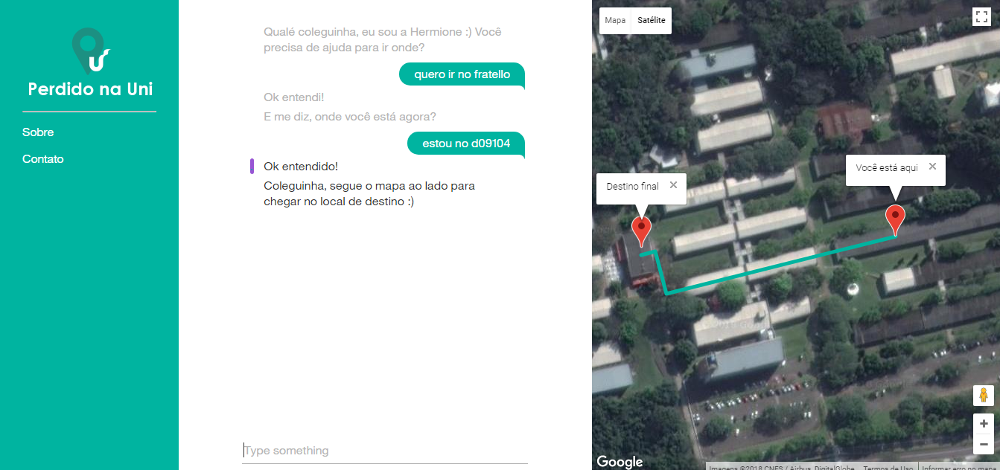

# Conversation Watson | Node 

Projeto com a utilização de Node.js e a API Assistant do Watson | IBM.

Trabalho realizado para a cadeira de Inteligência Artificial Unisinos/2018.
O contexto inicial do projeto é que o assistente de conversação ajude os alunos da Universidade Unisinos a chegar no ponto de destino determinado pelo aluno dentro do campus a partir da rota demonstrada no mapa.
A ideia é que o chatbot consiga reconhecer os locais passados de acordo com o vocabulário que utilizamos dentro do campus, com os apelidos dos locais utilizados pelos alunos.

Trabalho realizado por: Savanna Denega; Franciele Fagundes.

**Recursos utilizados:**

* API Assistant do Watson | IBM
* API Google Maps
* Node.js

**Print da aplicação**


## Instalação e configuração do ambiente local

### Passo 1: Clone do repositório do github

Faça clone do repositório atual: `https://github.com/savannadenega/conversation-watson-node`

### Passo 2:

Instale Node.js, realizando download no link: [Node.js](https://nodejs.org/en/download/)

Após instalados os requisitos, você precisa abrir o terminal e chegar 
até a pasta em que fez o clone do repositório via cmd,
clique neste [link](https://medium.com/@adsonrocha/como-abrir-e-navegar-entre-pastas-com-o-prompt-de-comandos-do-windows-10-68750eae8f47) para entender como fazer este procedimento.

Logo após execute o seguinte comando para instalar as dependências do projeto:

```
npm install -g http-server
```

Para rodar o servidor local, utilize o comando:

```
npm start
```

Abrir o link abaixo no seu navegador preferido:

```
http://localhost:3000
```

### Passo 3:

**Testes do chatbot**

Após o app ser instalado e estar rodando, experimente fazer perguntas e ver como ele responde.

A interface do chat fica na esquerda, e o JSON que o código JavaScript está recebendo da conversação abaixo.
As questões e os comandos são interpretados usando um pequeno exemplo de dados treinados seguindo os seguintes intenções:

```
#saudacaoInicial  
#saudacaoInicialAtual  
#localDestino  
#localOrigem  
#saudacaoFinal  
#voltarInicioConversa  
```

Escreva para onde deseja ir, no exemplo "quero ir para o ginásio", depois responda onde é a sua posição atual atual como "estou na biblioteca".
O sistema vai entender suas intenções e repondê-las, na ordem adequada. Você pode olhar os detalhes de como os inputs são entendidos pelo Watson examinando o JSON no payload na parte `Watson understands`.


**Testes Aplicação Final**

Realizamos duas POCs para a apresentação do projeto, em que o usuário insere as informações no chat de onde deseja ir e onde está, e então o mapa com a rota do trajeto é gerado e apresentada na tela.

* POC 1

Local de destino: `redondo` (Centro Administrativo)  
Local de origem: `ginásio` (ginásio de esportes)


* POC 2

Local de destino: `Fratello` (restaurante Fratello)  
Local de origem: `D09104` (sala D09104)




Como amostra, nós nos baseamos em uma mapa que a Unisinos já disponibiliza para os alunos se localizarem, no link: [Mapa da Unisinos de São Leopoldo](http://www.unisinos.br/mapa/localiza-se-campus-sao-leopoldo.php)


#### Código base retirado do projeto Open Source da IBM Watson:

[https://github.com/watson-developer-cloud/assistant-simple](https://github.com/watson-developer-cloud/assistant-simple)


