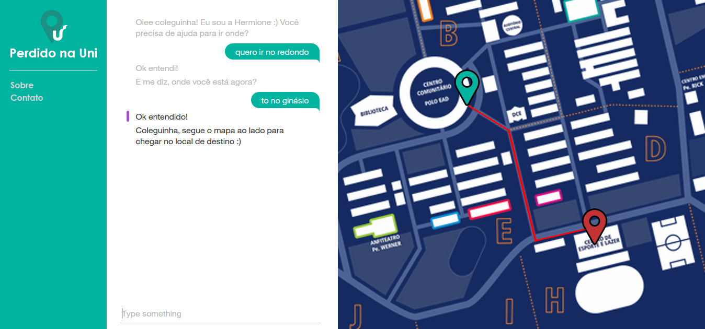

# Conversation Watson | Node 

Projeto com a utilização de Node.js e a API de Conversation do Watson-IBM.

Trabalho realizado para a cadeira de Inteligência Artificial Unisinos/2018.
O contexto inicial do projeto é que o assistente de conversação ajude os alunos da Universidade Unisinos a chegar no ponto de destino determinado pelo aluno dentro do campus.

Trabalho realizado por: Savanna Denega; Franciele Fagundes.

**Ideia de Protótipo Final do Projeto**




## Instalação e configuração do ambiente local

#### Passo 1: Clone do repositório do github

- Abra o terminal de seu computador
- [Repositório Github](https://github.com/CamiCanali/workshop-juntos-na-ti)
- Acessando o link disponibilizado, faça o clone do repositório. Exemplo no código abaixo:

```
git clone https://github.com/savannadenega/conversation-watson-node
```

#### Passo 2:

**Requisitos, instale Node.js, no link abaixo:**

[Nodejs](https://nodejs.org/en/download/)

Após instalados os requisitos, você precisa abrir o terminal e chegar 
até a pasta em que fez o clone do repositório via cmd,
clique neste [link](https://medium.com/@adsonrocha/como-abrir-e-navegar-entre-pastas-com-o-prompt-de-comandos-do-windows-10-68750eae8f47) para entender como fazer este procedimento.

Logo após execute o seguinte comando para instalar as dependências do projeto:

```
npm install -g http-server
```

Para rodar o servidor local, utilize o comando:

```
npm start
```

Abrir o link abaixo no seu navegador preferido:

```
http://localhost:3000
```

#### Passo 3:

**Teste a aplicação:**

Após o app ser instalado e estar rodando, experimente fazer perguntas e ver como ele responde.

A interface do chat fica na esquerda, e o JSON que o código JavaScript está recebendo da conversação fica na direita.
As questões e os comandos são interpretados usando um pequeno exemplo de dados treinados seguindo os seguintes intenções:

#saudacaoInicial
#saudacaoInicialAtual
#localDestino
#localOrigem
#saudacaoFinal

Escreva para onde deseja ir, como "quero ir para o ginásio", depois responda onde é a sua posição atual atual como "estou na biblioteca".
O sistema vai entender suas intenções e repondê-las, na ordem adequada. Você pode olhar os detalhes de como os inputs são entendido pelo Watson examinando o JSON na seção à direita `Watson understands`.
Modelo de localização utilizado do atual [Mapa da Unisinos de São Leopoldo](http://www.unisinos.br/mapa/localiza-se-campus-sao-leopoldo.php)


#### Código base retirado do projeto Open Source da IBM Watson:

[https://github.com/watson-developer-cloud/assistant-simple](https://github.com/watson-developer-cloud/assistant-simple)


